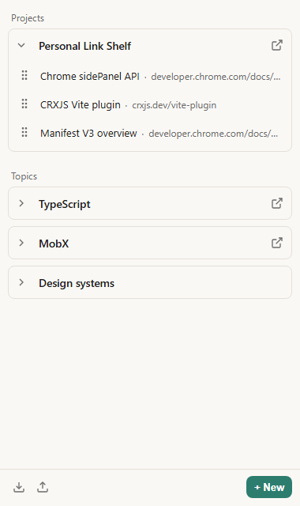
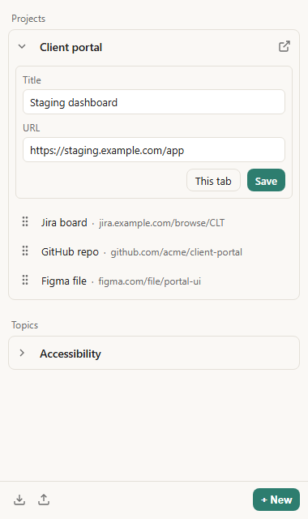

# Personal Link Shelf

<p align="center">
  
</p>

Chrome extension (Manifest V3). A side panel of named catalogs of links — topics and projects — stored locally on this machine. No account.

<p align="center">
  
  &nbsp;&nbsp;
  
</p>

## Capabilities

- Organize links into **topics** and **projects**, collapsed by default
- Manage catalogs and resources in the side panel — including saving the page you are on (from the panel or the right-click menu)
- Open one link or every URL in a catalog in new tabs
- Export and import the shelf as JSON

## Installation

1. In the repository root, run:

   ```bash
   npm ci
   npm run build
   ```

2. Open `chrome://extensions/`, enable **Developer mode**, and **Load unpacked** → select the `dist` folder.

3. Open the side panel from the extension toolbar icon.

Optional: the same build also writes `release/crx-personal-link-shelf-1.0.0.zip`.
