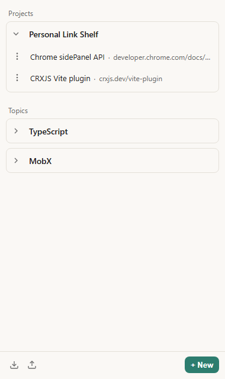

# Personal Link Shelf

<p align="center">
  
</p>

Chrome extension (Manifest V3). A **side panel** of named catalogs of links — topics and projects — stored locally on this machine. No account.

<p align="center">
  
</p>

## Install (unpacked)

1. Build the extension (see below) so `dist/` is up to date.
2. Open `chrome://extensions/`.
3. Turn on **Developer mode**.
4. Click **Load unpacked** and choose the `dist` folder in this repo.

The toolbar icon opens the side panel. Right-click a page → **Add to Personal Link Shelf** to save the current tab into a catalog.

## Build

```bash
npm install
npm run build
```

- Unpacked load path: `dist/`
- Packaged zip (same build): `release/crx-personal-link-shelf-1.0.0.zip`
